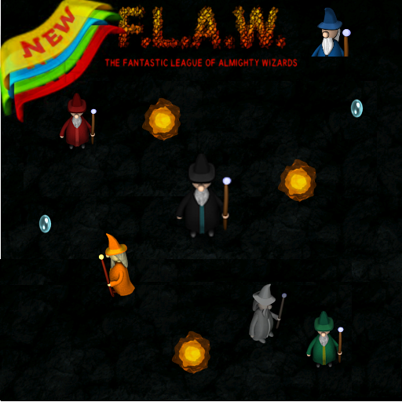

# F.L.A.W.
> Android Version of FLAW is a free top-down wizard battle game!

[//]: # ([![NPM Version][npm-image]][npm-url])
[//]: # ([![Build Status][travis-image]][travis-url])
[//]: # ([![Downloads Stats][npm-downloads]][npm-url])

This is an Android port of the game F.L.A.W. Game that is hosted on github, created by Denis Comtesse.
Hosted at https://sourceforge.net/projects/flaw/
"All bugs in this Android app can be attributed strictly to me. :)" As the desktop version is extremely stable.

## Installation
OS X & Linux:
   Download or clone https://github.com/pelya/commandergenius, This is SDL 1.2 and 1.3 ported to Google Android.
   Follow the README install instructions.
   Clone or download this project into the project/jni/application directory. All of the necessary graphic data files are included in this
   project. Using the ballfield compiling instructions, just replace the ballfield directory reference with flaw directory. 

Windows:
  Follow the window's installation procedure posted on the commandergenius site for windows. I don't have windows system so really can't say how this will go since it is unknown territory for me.
## Usage example
   All of the functionality of the original Desktop game is mostly in-tacked, except for the multiplayer and multiplayer controls, I really couldn't see this being practical on a small mobile devices. :)
## Development setup
 In order to simplify things a bit, a small modification to the ()/commandergenius/project/java/Video.java file was made to append the two letter language code to the command line passed into the main function, it just easier. If no other arguments are set in the AndroidAppSettings.cfg then this argument is at position 2, ie argv[2] = "en". Included in this repository is a copy of Video.java you can just copy it in your sdl-1.2 java directory.

## Release History
* 0.0.4 Additional ua language added.

* 0.0.3
    * Changed App to use original .po language files translations.
* 0.0.2
    * Work in progress

## Meta

FLAW Google Market download – [F.L.A.W. APP](https://play.google.com/store/apps/details?id=us.davidevans.games.flaw.paid)
App Market https://play.google.com/store/apps/details?id=us.davidevans.games.flaw.paid
===
David Evans Twitter – [@David_Lee_Evans](https://twitter.com/)
David Evans Email  –  [Email]david@davidevans.us

Distributed under the GPL Version 3 license. See ``LICENSE`` for more information.

[https://github.com/DavidLeeEvans/github-link](https://github.com/DavidLeeEvans/)

## Contributing

1. Fork it (<https://github.com/DavidLeeEvans/FLAW/fork>)
2. Create your feature branch (`git checkout -b feature/fooBar`)
3. Commit your changes (`git commit -am 'Add some fooBar'`)
4. Push to the branch (`git push origin feature/fooBar`)
5. Create a new Pull Request

<!-- Markdown link & img dfn's -->
[npm-image]: https://img.shields.io/npm/v/datadog-metrics.svg?style=flat-square
[npm-url]: https://npmjs.org/package/datadog-metrics
[npm-downloads]: https://img.shields.io/npm/dm/datadog-metrics.svg?style=flat-square
[wiki]: https://github.com/yourname/yourproject/wiki
